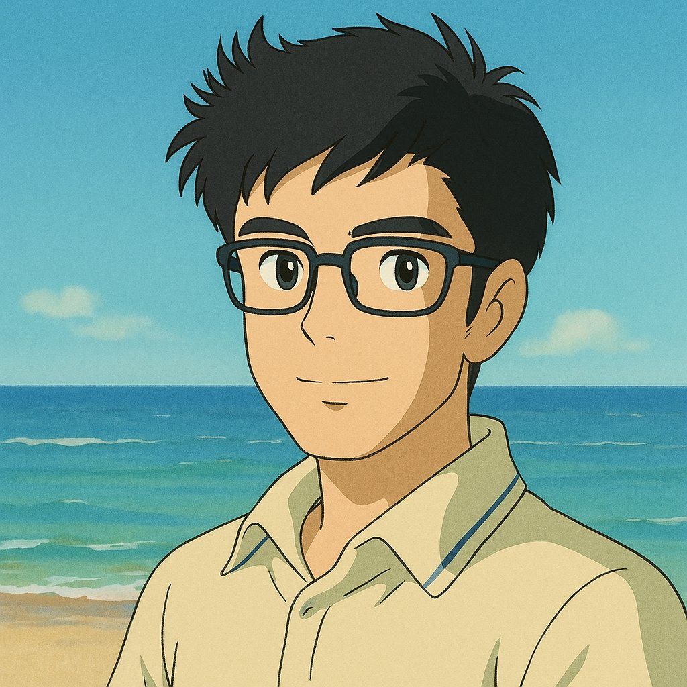

---
date:
    created: 2025-05-08
categories:
    - هوش مصنوعی
tags:
    - AI
authors:
    - Masoud
slug: ai-created-image
---

#  ایجاد عکس انیمه با هوش مصنوعی

در تصویر پایین پروفایل من رو مشاهده می‌کنید که با استفاده از یه مدل زبانی در هوش مصنوعی ایجاد شده.

<figure markdown="span">
  
  <figcaption>تصویر ایجاد شده به سبک Studio Ghibli</figcaption>
</figure>

<!-- more -->

برای ایجاد این سبک تصاویر که به Studio Ghibili معروف شده و امروز به ترند بخش ساخت تصویر در هوش مصنوعی تبدیل شده کافیه عکسی که تمایل دارین به صورت انیمه دربیاد رو به همراه Prompt زیر به مدل‌های زبانی از جمله GPT و یا Grok ارسال کنید.


``` title="Command prompt"
restyle this image in studio ghibli style, keep all details
```


امیدوارم از نتیجه کار لذت ببرین! :beers: