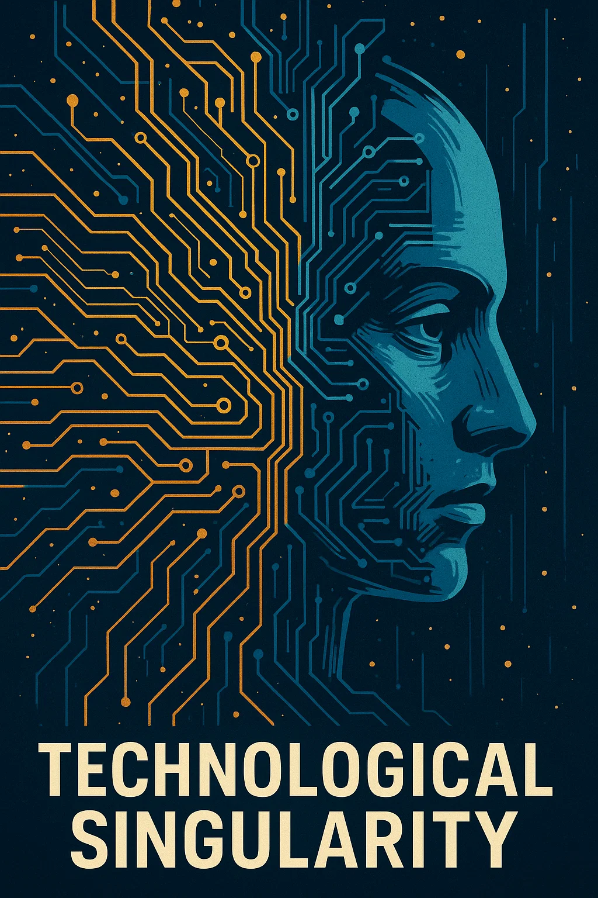

---
date:
    created: 2025-06-01
categories:
    - تکنولوژی
tags:
    - Technology
authors:
    - Masoud
slug: technological-singularity
---

# تکینگی تکنولوژیک

تکینگی تکنولوژیک: نقطه‌ای در آینده که تکنولوژی، به‌خصوص هوش مصنوعی، به قدری پیشرفت می‌کنه که دیگه توانایی پیش‌بینی کردن از انسان سلب می‌شه!

<figure markdown="span">
   
  <figcaption>تکینگی تکنولوژیک!</figcaption>
</figure>

<!-- more -->

تصور کنین هوش مصنوعی و یا ماشین‌ها به جایی برسند که از آدم‌ها باهوش‌تر بشن، خودشون بتونن خودشون رو بهتر کنن و یک مرتبه همه‌چیز دنیا عوض بشه. مثل یه انفجار عظیم در علم و تکنولوژی که همه‌چیز رو زیر و رو می‌کنه.
این که یه دفعه یه موجود خیلی باهوش‌تر از ما پیدا بشه و ما دیگه نفهمیم اون داره چی‌کار می‌کنه یا قراره چی بشه یه کمی ترسناکه، ولی در عین حال خیلی هیجان‌انگیزه! بعضی‌ها می‌گن این اتفاق می‌تونه خیلی خوب باشه (مثلاً بیماری‌ها رو درمان کنه) و بعضی‌ها هم می‌ترسن که کنترل اون از دست آدم‌ها در بره.

تکینگی هنوز اتفاق نیفتاده، پس به طور طبیعی یه مثال ازش توی دنیای واقعی نداریم! در واقع در حال حاضر یه مفهوم و نظریه‌ است که به آینده اشاره داره. در عوض می‌شه چند مثال خیالی یا موقعیت‌های واقعی که بهش ربط دارن رو اینجا آورد:

**۱- فیلم‌های علمی-تخیلی:** تو فیلم‌هایی مثل ماتریکس یا او (Her)، هوش مصنوعی به قدری پیشرفت می‌کنه که شروع می‌کنه به کنترل دنیا یا رابطه‌های عاطفی عجیب با آدم‌ها می‌سازه. این یه جور تصور از تکینگیه که نشون می‌ده بالاخره یک روی ماشین‌ها از ما جلو می‌زنن.

**۲- رمان‌های علمی-تخیلی:** تو کتاب‌های نویسنده‌هایی مثل ورنور وینج (که اصلاً مفهوم تکینگی رو اون مطرح کرده)، یه سناریو اینه که یه هوش مصنوعی خودش رو زود به زود ارتقا می‌ده و در عرض چند ساعت از یه برنامه ساده به یه موجود فوق باهوش تبدیل می‌شه که دنیا رو عوض می‌کنه.

**۳- هوش مصنوعی امروزی:** مدل‌های هوش مصنوعی مثل Grok یا ChatGPT نشون می‌دن که تکنولوژی چقدر سریع داره رشد می‌کنه. مثلاً، تو چند سال اخیر هوش مصنوعی از تولید متن ساده به خلق تصاویر، ویدیوها و حتی حل مسائل پیچیده رسیده. اگه این سرعت رشد ادامه پیدا کنه، می‌تونه یه روز به تکینگی نزدیک بشه.

**۴- شطرنج و بازی‌های فکری:** در سال ۱۹۷۷ وقتی Deep Blue (یه کامپیوتر) گری کاسپارف، قهرمان شطرنج دنیا، رو شکست داد، نمونه کوچکی از یه ماشین بود که بالاخره تو یه زمینه خاص از انسان باهوش‌تر شد. حالا تصور کنین این اتفاق تو همه زمینه‌ها بیافته!

**۵- اتوماسیون و ربات‌ها:** تو کارخونه‌ها، ربات‌ها دارن کارهای پیچیده‌تر و پیچیده‌تری انجام می‌دن. مثلاً تسلا از ربات‌های پیشرفته برای ساخت ماشین‌های خودش استفاده می‌کنه. اگه این ربات‌ها یه روزی بتونن خودشون طراحی‌های بهتری ارائه بدن و خودشون رو ارتقا بدن، یه قدم دیگه به تکینگی نزدیک‌تر می‌شیم.

**چرا مثال واقعی کامل نداریم؟**

چون تکینگی یک نقطه است که هنوز بهش نرسیدیم و ممکنه تو چند دهه آینده بهش نزدیک بشیم، ولی حتی دقیق نمی‌دونیم کی و چطور! فقط می‌دونیم اگه بشه، همه‌چیز (از پزشکی و اقتصاد تا زندگی روزمره) به ناگهان دگرگون می‌شه.
اگه بخوام به طور ساده بگم: تکینگی مثل یه طوفان تکنولوژیه که ابرهاش در حال تجمیع شدن هستن! مثلاً هر بار که یه هوش مصنوعی جدید کار عجیب و غریبی می‌کنه (مثل نوشتن شعر یا حل معادله‌های پیچیده)، یه قدم به وقوع اون طوفان نزدیک‌تر می‌شیم.